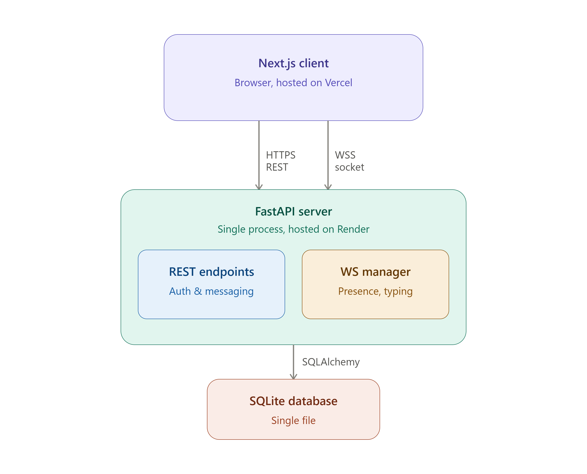

# Signal Clone — Secure Messaging Platform

A functional clone of Signal's core messaging experience: real-time 1:1 and
group chat, contacts, delivery/read receipts, typing indicators, message
reactions, and a dark-mode-capable UI built to feel like the real app.
Built as an SDE Fullstack assignment.

> Real end-to-end cryptography is **not** implemented. Encryption is
> simulated per the assignment spec (see the banner in the chat header) —
> messages are transmitted over HTTPS/WSS and stored as plaintext in the
> database, same as most non-E2EE chat apps.

## Tech stack

| Layer      | Choice                                              |
|------------|------------------------------------------------------|
| Frontend   | Next.js 15 (App Router, TypeScript), Tailwind CSS v4  |
| Backend    | FastAPI (Python), SQLAlchemy ORM                      |
| Database   | SQLite                                                |
| Real-time  | Native WebSockets (single `/ws` endpoint, no polling) |
| Auth       | JWT (python-jose), mocked OTP verification            |
| Deployment | Render (backend), Vercel (frontend)                   |

---

## High-Level Design (HLD)

### System overview



- **One backend process, one database file, one WebSocket endpoint.** There's
  no message queue, cache layer, or separate real-time service — for this
  scope, an in-process `ConnectionManager` (a `dict[user_id -> sockets]`)
  is sufficient and keeps the deployment simple (single Render service).
- **REST handles all state changes** (send message, add reaction, create
  group). **WebSocket only carries fan-out notifications** — it never
  originates state; clients always call a REST endpoint first, and the
  server pushes the resulting change to other connected members. This
  means a client that misses a WebSocket event (e.g. was offline) is never
  out of sync — the next `GET /conversations` or `GET /messages` call
  always reflects true state from the database.
- **Client holds no source-of-truth state.** The frontend's React state
  (`messagesByConv`, `conversations`) is a cache populated from REST calls
  and kept live by WebSocket events; it's rebuilt from the server on every
  page load / reconnect.

### Component breakdown

| Component | Responsibility |
|---|---|
| `routers/auth.py` | Mocked OTP + JWT issuance |
| `routers/contacts.py` | Contact list & user search |
| `routers/conversations.py` | Core domain logic: conversations, messages, receipts, reactions, group membership |
| `routers/ws.py` | WebSocket lifecycle: connect, presence broadcast, typing relay, disconnect |
| `ws_manager.py` | In-memory registry of live sockets per user; fan-out helper |
| `auth-context.tsx` (frontend) | Session state, exposes `login`/`register`/`logout` to the whole app |
| `use-socket.ts` (frontend) | One persistent WebSocket connection per session, auto-reconnect, typed event dispatch |
| `theme-context.tsx` (frontend) | Dark/light mode state, persisted to `localStorage` |
| `chat/page.tsx` (frontend) | Orchestrator — owns conversation/message state, wires REST + WebSocket events into the UI tree |

### Real-time event flow (example: sending a message)

```
User A types & hits send
        │
        ▼
POST /conversations/{id}/messages   (REST, persists to DB)
        │
        ▼
Server creates Message row + per-recipient MessageReceipt rows
        │
        ▼
Server broadcasts {"type": "new_message", ...} over WebSocket
        │
        ▼
User B's browser (if online) receives it instantly, updates UI,
then calls POST /conversations/{id}/read if that chat is open
        │
        ▼
Server updates receipts to "read", broadcasts {"type": "read_receipt"}
        │
        ▼
User A's UI updates the checkmark to blue (read)
```

The same pattern (REST write → DB → WebSocket fan-out → UI update) is used
identically for reactions, typing indicators, and membership changes —
one consistent flow across every real-time feature, rather than a special
case per feature.

---

## Low-Level Design (LLD)

### Database schema

```
users(id, username, phone, display_name, avatar_url, avatar_color,
      password_hash, created_at, last_seen, is_online)

contacts(id, user_id -> users.id, contact_user_id -> users.id, created_at)
  -- one-directional edge; a mutual add creates two rows

conversations(id, type[direct|group], name, avatar_color, created_by, created_at)

conversation_members(id, conversation_id -> conversations.id,
                      user_id -> users.id, role[member|admin],
                      joined_at, last_read_message_id)
  -- last_read_message_id drives the unread badge and read-receipt cutoff

messages(id, conversation_id -> conversations.id, sender_id -> users.id,
         content, status[sending|sent|delivered|read], created_at)

message_receipts(id, message_id -> messages.id, user_id -> users.id,
                  status[delivered|read], updated_at)
  -- one row per (message, recipient); lets group chats track
     per-member delivery/read state instead of a single global status

message_reactions(id, message_id -> messages.id, user_id -> users.id,
                   emoji, created_at)
  -- unique on (message_id, user_id, emoji): one user can react to the
     same message with several different emoji, but not duplicate the
     same emoji twice — a second identical request toggles it off
```

**Design notes**
- `conversation_members` is shared by both direct and group chats — a
  direct chat is just a 2-member conversation — which keeps the messaging
  and receipt logic identical for both without a separate 1:1 code path.
- `message_receipts` is per-recipient rather than a single status on the
  message row, so a group message can be "delivered" to one member and
  "read" by another simultaneously. The `status` column on `messages`
  itself reflects the sender's own bubble state.
- `message_reactions` is intentionally its own table rather than a JSON
  column on `messages` — this keeps "who reacted with what" queryable and
  lets the toggle-on/toggle-off logic rely on a plain unique-constraint
  lookup instead of parsing/mutating a blob.

### API overview

| Method | Path                                   | Purpose                              |
|--------|-----------------------------------------|---------------------------------------|
| POST   | `/auth/request-otp`                    | Mocked OTP send (returns the code)    |
| POST   | `/auth/register`                       | Verify OTP + create account           |
| POST   | `/auth/login`                          | Username/password login               |
| GET    | `/auth/me`                             | Current session's user                |
| GET    | `/contacts`                            | List saved contacts                   |
| POST   | `/contacts`                            | Add a contact by username             |
| GET    | `/contacts/search?q=`                  | Search users by username/name         |
| GET    | `/conversations`                       | List conversations, sorted by activity, with last message + unread count |
| POST   | `/conversations/direct`                | Start (or reuse) a 1:1 conversation   |
| POST   | `/conversations/group`                 | Create a group                        |
| GET    | `/conversations/{id}/messages`         | Full message history (with reactions) |
| POST   | `/conversations/{id}/messages`         | Send a message (persists + broadcasts over WebSocket) |
| POST   | `/conversations/{id}/read`             | Mark conversation read, emits read receipts |
| POST   | `/conversations/{id}/members`          | Add group members                     |
| DELETE | `/conversations/{id}/members/{userId}` | Remove a member (admin-only, or self) |
| POST   | `/conversations/{id}/messages/{msgId}/reactions` | Toggle a reaction (add if absent, remove if already reacted with that emoji) |
| WS     | `/ws?token=`                           | Live events: `new_message`, `typing`, `read_receipt`, `reaction_updated`, `presence`, `conversation_updated` |

All routes except `/auth/*` and `/ws` require `Authorization: Bearer <token>`.

### Frontend module layout

```
src/
├── app/
│   ├── login/page.tsx     Login + registration (mocked OTP) flow
│   └── chat/page.tsx      State owner: conversations, messages, WebSocket
│                          event handlers, all cross-component wiring
├── components/
│   ├── Sidebar.tsx        Conversation list, search, dark-mode toggle
│   ├── ChatWindow.tsx     Header, message list, typing indicator, composer
│   ├── MessageBubble.tsx  Bubble rendering, status ticks, reaction pills
│   │                      + hover-to-react picker
│   ├── Modal.tsx          Shared modal shell
│   ├── NewChatModal.tsx   User search → start direct conversation
│   ├── NewGroupModal.tsx  Group creation with multi-select members
│   └── InfoPanel.tsx      Group members list, admin add/remove controls
└── lib/
    ├── api.ts             Typed REST client (one function per endpoint)
    ├── auth-context.tsx   Session state provider
    ├── theme-context.tsx  Dark/light mode provider (localStorage-backed)
    ├── use-socket.ts      WebSocket connection + typed event union
    ├── types.ts           Shared TypeScript interfaces (mirrors backend schemas)
    └── format.ts          Timestamp/title formatting helpers
```

**State flow within `chat/page.tsx`:** REST calls populate
`conversations` and `messagesByConv`; `useSocket`'s single event handler
is a switch over the WebSocket event's `type` field, updating the same
state via `setMessagesByConv`/`setConversations`. Every child component
(`Sidebar`, `ChatWindow`, `InfoPanel`) is a pure function of that state —
none of them hold their own copy of conversation/message data, which
avoids the two-sources-of-truth bugs that come from letting child
components independently re-fetch.

---

## Setup

### Backend

```bash
cd backend
python -m venv venv && source venv/bin/activate   # Windows: venv\Scripts\activate
pip install -r requirements.txt
python -m app.seed        # creates signal_clone.db and seeds sample data
uvicorn app.main:app --reload --port 8000
```

Backend runs at `http://localhost:8000`. Interactive API docs at
`http://localhost:8000/docs`.

### Frontend

```bash
cd frontend
npm install
cp .env.example .env.local   # defaults already point at localhost:8000
npm run dev
```

Frontend runs at `http://localhost:3000` and redirects to `/login`.

### Demo accounts (seeded)

| Username | Password    |
|----------|-------------|
| shashank | password123 |
| aarav    | password123 |
| priya    | password123 |
| kabir    | password123 |
| neha     | password123 |

Log in as two different users in two browser windows (or one normal + one
incognito) to see real-time delivery, typing indicators, reactions, and
read receipts in action.

To register a brand-new account instead, use "Create account" — OTP
verification is mocked and the code is shown on-screen (`123456`) instead
of being sent via SMS.

## What's implemented vs. placeholder

**Implemented:** mocked auth/OTP, contacts + search, 1:1 and group
messaging over WebSocket, persisted history, delivery/read receipts,
typing indicators, unread badges, online/last-seen, group admin controls
(add/remove members), message reactions (emoji, real-time, toggleable),
dark mode (persisted, system-preference-aware), Signal-style UI
(conversation list + chat pane, bubble styling, checkmarks).

**Placeholder ("Coming soon"):** voice/video calls, stories, linked
devices, attachments, disappearing messages, notification/privacy
settings — all shown in the UI as non-functional stubs per the
assignment's allowed placeholder list.

## Assumptions made

- OTP is a fixed code (`123456`) for every phone number, per the spec's
  "verification can be mocked" note — no SMS provider is integrated.
- A single JWT secret is hardcoded for local/demo use
  (`backend/app/auth.py`); this would move to an environment variable
  before any real deployment.
- "Online" status is derived purely from an open WebSocket connection —
  there's no separate heartbeat/idle-timeout logic.
- Direct-conversation de-duplication: starting a new chat with someone you
  already have a 1:1 conversation with reopens the existing thread instead
  of creating a duplicate.
- Password hashing uses SHA-256 for simplicity in this demo; a production
  build would use bcrypt/argon2 with per-user salts.
- The deployed backend uses SQLite on Render's free tier, which has an
  ephemeral filesystem — data resets on redeploy/restart. A production
  version would use a persistent database (Postgres).

## Deployment

- **Backend:** Render — root directory `backend`, build command
  `pip install -r requirements.txt && python -m app.seed`, start command
  `uvicorn app.main:app --host 0.0.0.0 --port $PORT`.
- **Frontend:** Vercel — root directory `frontend`, environment variables
  `NEXT_PUBLIC_API_URL` (`https://...`) and `NEXT_PUBLIC_WS_URL`
  (`wss://...`) pointing at the deployed backend.
